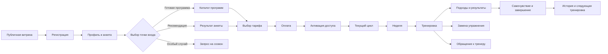
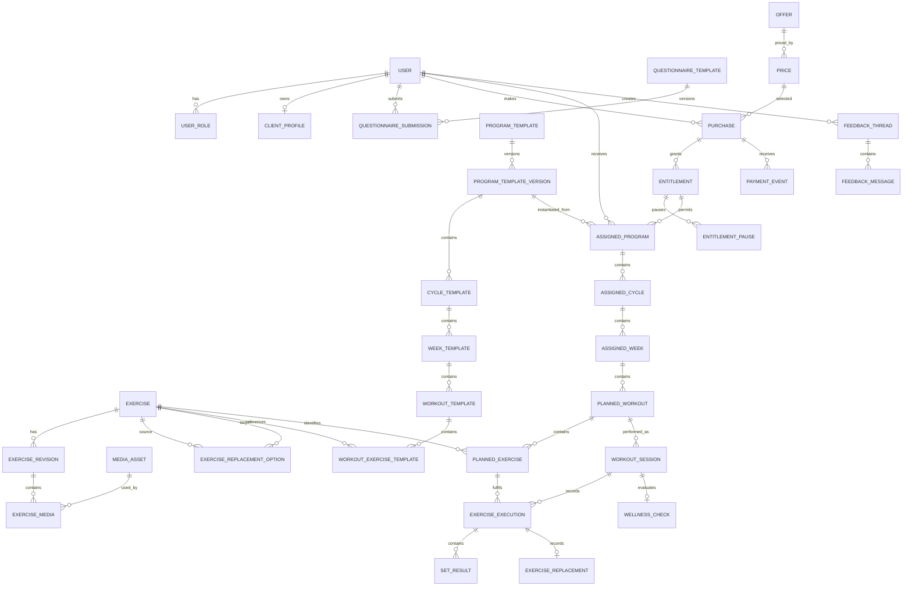
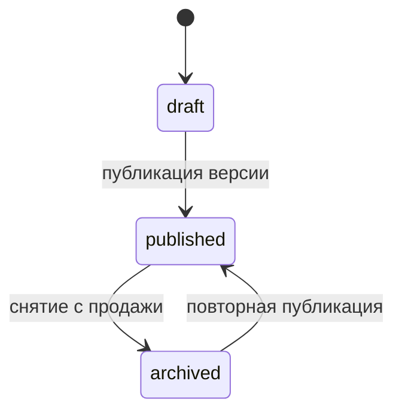
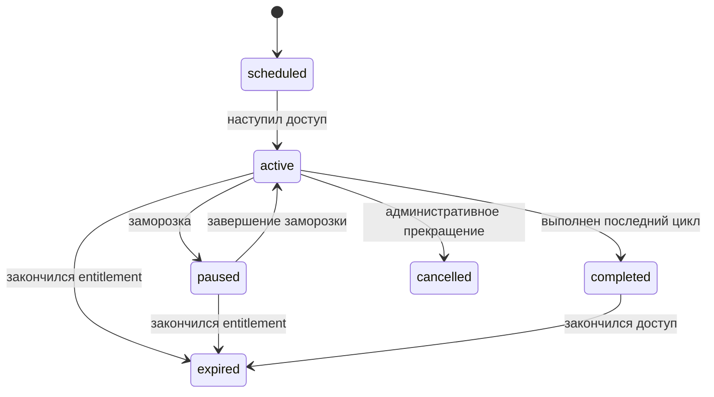
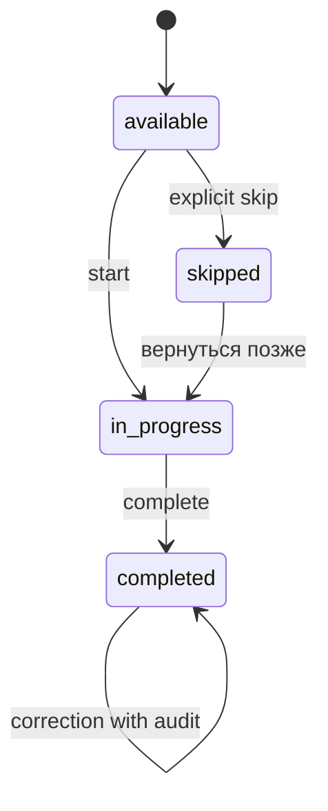
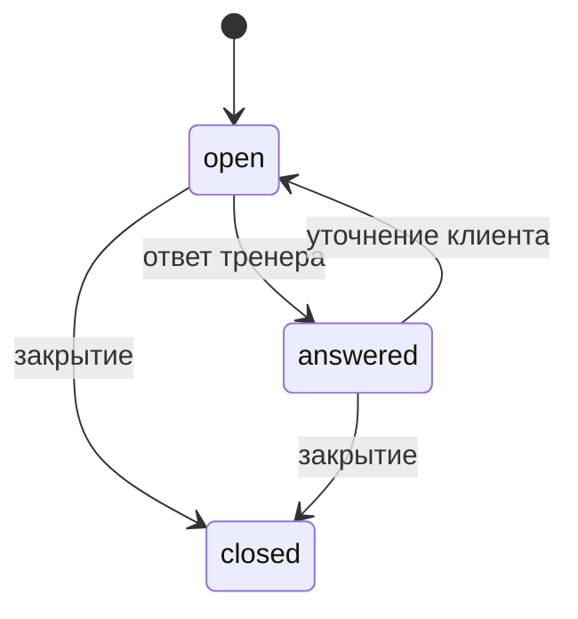
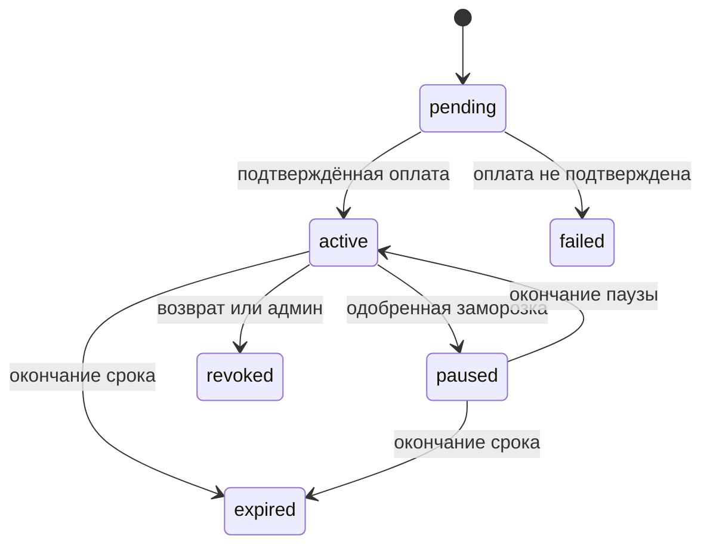
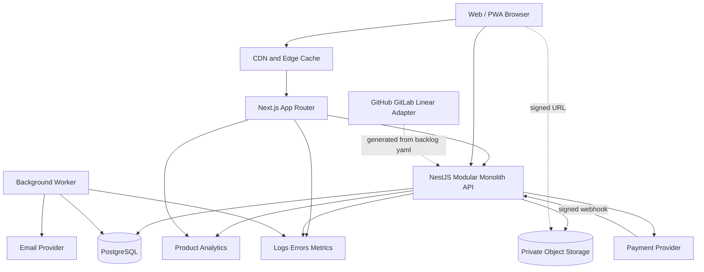
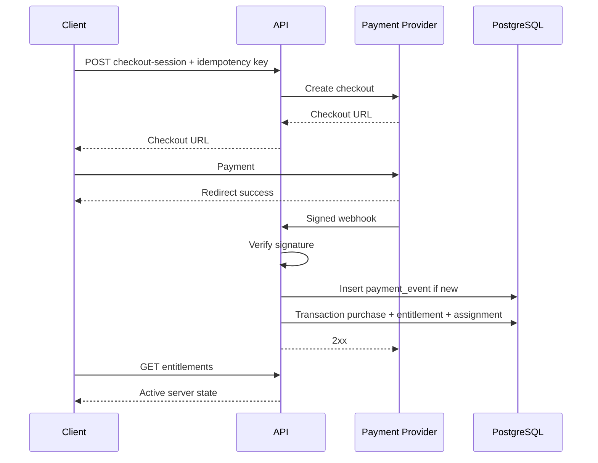

# Продуктово-технический baseline фитнес-платформы

Исследование основано на трёх группах материалов: исходном задании на глубокое исследование, описании ожидаемого набора проектных артефактов и фактическом диалоге с Лёшей, включая его ответы о продукте. Исходный промпт задаёт правильный принцип: бизнес-факты должны быть отделены от предположений, противоречия нельзя скрывать, а техническое проектирование должно следовать после нормализации бизнес-логики. Ожидаемый результат — не один формальный документ, а связанная цепочка «источник → требование → правило → модель → API → задача → тест».

Фактические продуктовые выводы ниже основаны прежде всего на ответах Лёши. Значительная часть ответов уже определяет направление продукта, но пока не образует непротиворечивую спецификацию: встречаются ответы «да/нет», ответы на вопросы с несколькими вариантами одновременно и правила, которые меняются в разных частях диалога.

Используются четыре статуса:

| Статус              | Значение                                                                        |
| ------------------- | ------------------------------------------------------------------------------- |
| **Подтверждено**    | Прямо и достаточно однозначно сказано Лёшей                                     |
| **Предположение**   | Логичный вывод из материалов, но прямого подтверждения нет                      |
| **Рекомендация**    | Предлагаемое продуктовое или техническое решение                                |
| **Требует решения** | Неопределённость, которая меняет MVP, данные, API или пользовательский сценарий |

## Продукт

**Сводная концепция.** **Подтверждено:** продукт представляет собой платную web-first фитнес-платформу, в которой клиент получает тренировочную программу, смотрит видео с техникой, выполняет тренировки, записывает результаты каждого подхода, оценивает нагрузку и самочувствие, может заменять упражнения и обращаться к тренеру. Помимо тренировок планируются отдельная библиотека упражнений и база знаний о сне, питании, восстановлении, технике и привычках. Доступ привязан к оплате и ограниченному периоду.

**Рекомендация:** позиционировать ядро не как «универсальное фитнес-приложение», а как **систему продажи и прохождения структурированных тренировочных циклов с видеоинструкциями, журналом результатов и ограниченной поддержкой тренера**. Это точнее отражает подтверждённую логику и защищает первую версию от разрастания в трекер питания, медицинскую платформу, социальную сеть или универсальный marketplace тренеров.

**Проблема клиента.** **Предположение:** целевой клиент имеет программу или желание тренироваться, но ему не хватает структуры, понятной техники, последовательности нагрузки и удобной фиксации результатов. Конкретный сегмент — новичок, продолжающий, клиент с ограничениями, посетитель зала или домашний пользователь — пока не определён. Лёша подтвердил цели, уровень, оборудование, место тренировок и ограничения как важные данные, но не зафиксировал приоритетную аудиторию.

**Ценность клиента.** **Подтверждено:** клиент получает готовый оплаченный цикл, видео каждого упражнения, заданные подходы, повторения, вес, темп и отдых, историю предыдущих результатов, рекомендации по нагрузке, возможность замены и канал обращения к тренеру.

**Ценность тренера.** **Предположение:** платформа позволяет Лёше продавать повторно используемые программы, библиотеку и сопровождение, сохраняя индивидуальную работу для особых случаев. Этот вывод следует из разделения на шаблонные программы, индивидуальное ведение, тарифы и платные обращения.

**Ценность бизнеса.** **Подтверждено:** предусмотрены программа как платный продукт, отдельный доступ к библиотеке, тариф с сопровождением, дополнительная оплата обращений и бесплатный минимальный контент как точка входа. Точная монетизационная модель ещё не согласована.

### Границы продукта

| Область                                  | Решение                                                             |
| ---------------------------------------- | ------------------------------------------------------------------- |
| Тренировочные программы                  | Ядро                                                                |
| Видео и техника упражнений               | Ядро                                                                |
| Журнал подходов и результатов            | Ядро                                                                |
| Оплата и управление доступом             | Ядро                                                                |
| Обратная связь с тренером                | Ядро, но в ограниченной форме                                       |
| Библиотека упражнений                    | Подтверждена как отдельный платный продукт                          |
| База знаний                              | Подтверждена; в MVP допустима статичная реализация                  |
| Автоматическая прогрессия                | Не входит в первую версию по финальному ответу Лёши                 |
| Графики прогресса                        | Не входят в первую версию                                           |
| Другие тренеры                           | Не входят в первую версию                                           |
| Нативные iOS/Android-приложения          | Не требуются для проверки ценности; рекомендован адаптивный web/PWA |
| КБЖУ, питание-трекер, носимые устройства | Не подтверждены и не должны добавляться                             |
| Социальные функции                       | Не подтверждены                                                     |
| Полноценный чат с медиа                  | Не подтверждён; текстовой обратной связи достаточно для MVP         |
| Медицинская диагностика                  | Не является частью продукта                                         |

### Роли и права

Лёша указал, что на старте полный доступ имеют он и Андрей, а обычные клиенты административных возможностей не имеют. В будущем могут появиться другие тренеры.

| Роль                            | Подтверждённая ответственность                                               | Рекомендованная модель                                          |
| ------------------------------- | ---------------------------------------------------------------------------- | --------------------------------------------------------------- |
| Посетитель                      | Может видеть минимальный бесплатный контент                                  | Неаутентифицированный доступ к публичному каталогу              |
| Зарегистрированный пользователь | Может зарегистрироваться без покупки                                         | Может заполнить профиль, увидеть каталог и бесплатные материалы |
| Клиент                          | Покупает доступ, проходит программу, сохраняет результаты, создаёт обращения | Отдельная роль или capability, возникающая после покупки        |
| Тренер                          | Лёша управляет программами и работает с клиентами                            | Отдельная роль, даже если сейчас совмещена с администратором    |
| Администратор                   | Лёша и Андрей могут управлять всем                                           | Системные операции, пользователи, платежи, доступы, контент     |
| Контент-менеджер                | Не подтверждён                                                               | Не создавать отдельную роль в MVP                               |
| Поддержка                       | Не подтверждена                                                              | Не создавать отдельную роль в MVP                               |

**Рекомендация:** не использовать одну роль `admin` для всей бизнес-логики. Даже если на старте Лёша и Андрей имеют полный доступ, следует разделить права `ADMIN` и `TRAINER`. Иначе появление второго тренера потребует опасного переустройства доступа ко всем клиентам, платежам и системным настройкам.

Предварительная матрица:

| Операция                              |      Клиент |                      Тренер |                      Администратор |
| ------------------------------------- | ----------: | --------------------------: | ---------------------------------: |
| Изменить собственный профиль          |          Да |                         Нет |                                 Да |
| Смотреть собственную анкету и историю |          Да |                         Нет |                                 Да |
| Смотреть клиента                      |         Нет | Только назначенных клиентов |                                 Да |
| Создавать упражнение                  |         Нет |                          Да |                                 Да |
| Создавать программу                   |         Нет |                          Да |                                 Да |
| Назначать или выдавать программу      |         Нет |                          Да |                                 Да |
| Редактировать результат клиента       |         Нет |       Требует подтверждения |                                 Да |
| Управлять оплатой и возвратом         |         Нет |                         Нет |                                 Да |
| Продлевать доступ                     |         Нет |       Требует подтверждения |                                 Да |
| Смотреть данные о здоровье            | Только свои | Только назначенных клиентов | Только при служебной необходимости |
| Управлять ролями                      |         Нет |                         Нет |                                 Да |

### Основной путь пользователя



**Подтверждено:** регистрация самостоятельная; существует минимальный бесплатный контент; основная информация и тренировки платные; программа может выбираться клиентом; оплата должна происходить внутри системы; доступ после оплаты выдаётся автоматически.

**Требует решения:** анкета действительно автоматически рекомендует программу или пока только собирает данные. Первичная концепция говорит об автоматической рекомендации, но правила подбора не описаны. Для MVP безопаснее использовать анкету как сбор данных, а подбор выполнять вручную либо по простой заранее утверждённой таблице соответствий.

### Нормализованные требования

Ниже приведён рабочий реестр требований. Источником бизнес-фактов является диалог с Лёшей.

| ID                  | Требование                                                                                      | Статус                                          | Основные зависимости                |
| ------------------- | ----------------------------------------------------------------------------------------------- | ----------------------------------------------- | ----------------------------------- |
| REQ-ID-001          | Пользователь может самостоятельно зарегистрироваться                                            | Подтверждено                                    | Авторизация, согласия, профиль      |
| REQ-ID-002          | У пользователя может не быть оплаченной программы                                               | Подтверждено косвенно                           | Публичный каталог, free entitlement |
| REQ-ROLE-001        | Лёша и Андрей имеют полный административный доступ                                              | Подтверждено                                    | RBAC, аудит                         |
| REQ-ROLE-002        | В будущем система должна поддержать других тренеров                                             | Подтверждено как будущее                        | Ownership клиентов, trainer scope   |
| REQ-PROFILE-001     | Хранятся имя, возраст, пол, рост, вес, цель, опыт, ограничения, оборудование и место тренировок | Подтверждено общим ответом, требует детализации | Анкета, GDPR, формы                 |
| REQ-PROFILE-002     | Хранятся анкеты и их ответы                                                                     | Подтверждено                                    | Версионирование анкеты              |
| REQ-PROFILE-003     | Для особых случаев возможен диагностический созвон                                              | Подтверждено                                    | Feedback/booking, вручную в MVP     |
| REQ-PROGRAM-001     | Большинство программ создаётся из шаблонов                                                      | Подтверждено                                    | Шаблоны и версии                    |
| REQ-PROGRAM-002     | Индивидуальная программа нужна для особых ограничений                                           | Подтверждено                                    | Тренерский кабинет                  |
| REQ-PROGRAM-003     | Один шаблон можно назначать нескольким клиентам                                                 | Подтверждено                                    | Snapshot назначения                 |
| REQ-PROGRAM-004     | Изменение шаблона не меняет уже выданную программу                                              | Подтверждено                                    | Копирование/версионирование         |
| REQ-PROGRAM-005     | Программа имеет название, цель, уровень, описание и длительность                                | Подтверждено                                    | Каталог                             |
| REQ-PROGRAM-006     | Шаблон может быть черновиком и опубликован без назначения                                       | Подтверждено                                    | Состояния публикации                |
| REQ-PROGRAM-007     | Одновременно несколько программ клиенту нецелесообразны                                         | Предположение об ограничении                    | Unique active assignment            |
| REQ-CYCLE-001       | Базовый цикл длится четыре недели                                                               | Подтверждено                                    | Доступ и расписание                 |
| REQ-CYCLE-002       | Продукты на три и шесть месяцев состоят из нескольких циклов                                    | Вероятно, но ответ неоднозначен                 | Commerce, программа                 |
| REQ-WEEK-001        | По умолчанию неделя содержит три тренировки                                                     | Подтверждено                                    | Шаблон недели                       |
| REQ-WEEK-002        | Количество тренировок должно быть настраиваемым                                                 | Подтверждено                                    | Не фиксировать `3` в схеме          |
| REQ-WEEK-003        | Неделя логическая, а не обязательно календарная                                                 | Подтверждено                                    | Прогресс программы                  |
| REQ-WEEK-004        | Клиент может перейти к следующей неделе и вернуться к пропущенной тренировке                    | Подтверждено                                    | Навигация и статусы                 |
| REQ-WORKOUT-001     | Тренировка может содержать разминку, основную часть и заминку                                   | Подтверждено                                    | Структура блоков                    |
| REQ-WORKOUT-002     | Основная часть — упорядоченный список упражнений                                                | Подтверждено                                    | `position`                          |
| REQ-WORKOUT-003     | Тренировка содержит цель и вступление тренера                                                   | Подтверждено                                    | Контент                             |
| REQ-WORKOUT-004     | Одновременно может быть только одна начатая тренировка                                          | Подтверждено                                    | Блокировка, уникальный индекс       |
| REQ-WORKOUT-005     | Незавершённая тренировка сохраняется                                                            | Подтверждено                                    | Autosave                            |
| REQ-WORKOUT-006     | Тренировку можно завершить с невыполненными упражнениями                                        | Подтверждено                                    | Completion rules                    |
| REQ-WORKOUT-007     | Результаты завершённой тренировки можно редактировать                                           | Подтверждено, срок не определён                 | Audit, concurrency                  |
| REQ-EX-001          | Упражнение имеет видео, описание, ошибки, подсказки, отдых, мышцы и оборудование                | Подтверждено                                    | Exercise revision                   |
| REQ-EX-002          | Видео упражнения обязательно                                                                    | Подтверждено                                    | Публикационная валидация            |
| REQ-EX-003          | У упражнения может быть несколько видео                                                         | Подтверждено                                    | Media ordering                      |
| REQ-EX-004          | Упражнение может иметь лёгкие, сложные и заменяющие варианты                                    | Подтверждено                                    | Replacement catalogue               |
| REQ-PLAN-001        | Назначенное упражнение содержит подходы, повторения, вес, темп и отдых                          | Подтверждено                                    | Measurement model                   |
| REQ-PLAN-002        | Параметры упражнения могут отличаться в каждой тренировке и неделе                              | Подтверждено                                    | Snapshot per planned exercise       |
| REQ-PLAN-003        | Нарушение порядка не блокируется технически                                                     | Подтверждено                                    | UX recommendation only              |
| REQ-RESULT-001      | Клиент сохраняет фактический результат каждого подхода                                          | Подтверждено                                    | Set result                          |
| REQ-RESULT-002      | Подходы могут различаться по весу и повторениям                                                 | Подтверждено                                    | Per-set fields                      |
| REQ-RESULT-003      | Поддерживаются повторения, вес, время и расстояние                                              | Подтверждено                                    | Discriminated metric types          |
| REQ-RESULT-004      | Можно добавлять и удалять ошибочные или дополнительные подходы                                  | Подтверждено                                    | Audit, ordering                     |
| REQ-RESULT-005      | Показывается результат предыдущего выполнения                                                   | Подтверждено                                    | History query                       |
| REQ-RPE-001         | RPE вводится числом после каждого подхода                                                       | Подтверждено                                    | Numeric scale                       |
| REQ-WELLNESS-001    | Оцениваются усталость, сон, настроение, боль и дискомфорт                                       | Подтверждено                                    | Health data                         |
| REQ-WELLNESS-002    | При боли автоматическое увеличение нагрузки запрещается                                         | Подтверждено                                    | Recommendation guard                |
| REQ-METRIC-001      | Тоннаж считается как вес × повторения по всем подходам                                          | Подтверждено                                    | Exercise applicability              |
| REQ-METRIC-002      | Вес тела в тоннаж не входит                                                                     | Подтверждено                                    | Calculation rule                    |
| REQ-METRIC-003      | Личные рекорды нужны, графики не нужны в MVP                                                    | Подтверждено                                    | Derived metrics                     |
| REQ-PROGRESSION-001 | Финальное решение о весе принимает клиент                                                       | Подтверждено                                    | Disclaimer, actual value            |
| REQ-PROGRESSION-002 | Автоматическая прогрессия не входит в MVP                                                       | Подтверждено финальным MVP-ответом              | Отложить алгоритм                   |
| REQ-REPLACE-001     | Причины замены: боль, сложность, оборудование, предпочтение                                     | Подтверждено                                    | Reason enum                         |
| REQ-REPLACE-002     | Результаты разных упражнений не сравниваются                                                    | Подтверждено                                    | History segmentation                |
| REQ-FEEDBACK-001    | Обращение создаётся отдельной кнопкой и содержит текст                                          | Подтверждено                                    | Feedback thread                     |
| REQ-FEEDBACK-002    | Обращение может касаться боли, техники, нагрузки, замены или общего вопроса                     | Подтверждено                                    | Category enum                       |
| REQ-FEEDBACK-003    | Количество обращений зависит от тарифа, дополнительные обращения оплачиваются                   | Подтверждено концептуально                      | Quotas, commerce                    |
| REQ-LIBRARY-001     | Библиотека упражнений может оплачиваться отдельно                                               | Подтверждено                                    | Отдельный entitlement               |
| REQ-KB-001          | База знаний содержит статьи, видео, подборки и памятки                                          | Подтверждено                                    | CMS/admin                           |
| REQ-KB-002          | Материал может быть связан с программой, неделей и упражнением                                  | Подтверждено                                    | Polymorphic links                   |
| REQ-ACCESS-001      | Срок начинается с момента покупки                                                               | Подтверждено                                    | Payment timestamp                   |
| REQ-ACCESS-002      | После окончания срока платный доступ закрывается                                                | Подтверждено                                    | Entitlement                         |
| REQ-ACCESS-003      | Клиент может заморозить доступ на одну неделю один раз в месяц                                  | Подтверждено                                    | Pause rules                         |
| REQ-PAY-001         | Оплата MVP происходит внутри продукта                                                           | Подтверждено                                    | Payment provider                    |
| REQ-PAY-002         | После успешной оплаты доступ выдаётся автоматически                                             | Подтверждено                                    | Webhook, idempotency                |
| REQ-PAY-003         | Возможны бесплатный продукт, trial и несколько тарифов                                          | Подтверждено концептуально                      | Offers/prices                       |
| REQ-NOTIFY-001      | Клиенту нужны напоминания о тренировках, сообщениях и окончании доступа                         | Подтверждено                                    | Канал не определён                  |
| REQ-NOTIFY-002      | Тренеру нужны уведомления о новом клиенте, боли и новом обращении                               | Подтверждено частично                           | Severity and channel                |
| REQ-HISTORY-001     | История содержит тренировки, подходы, тоннаж, самочувствие, комментарии и замены                | Подтверждено                                    | Data retention                      |
| REQ-OFFLINE-001     | Полноценная работа без интернета не требуется                                                   | Подтверждено последующим ответом                | Autosave retry всё равно нужен      |

### Информационная архитектура

**Рекомендация:** использовать одно адаптивное web-приложение с тремя областями, а не отдельные продукты.

```text
/
  /programs
  /library
  /knowledge
  /pricing
  /login
  /register

/app
  /dashboard
  /profile
  /questionnaire
  /program
  /program/weeks/:weekId
  /workouts/:workoutId
  /workouts/:workoutId/session
  /history
  /feedback
  /library
  /knowledge
  /billing

/trainer
  /clients
  /clients/:clientId
  /program-templates
  /program-templates/:templateId
  /exercises
  /feedback

/admin
  /users
  /entitlements
  /payments
  /content
  /audit
  /system
```

Для клиента основная навигация должна содержать не более пяти главных точек: «Сегодня/Программа», «История», «Библиотека», «Знания», «Профиль». Платёжные и тарифные разделы могут находиться внутри профиля. Администраторская и тренерская зоны должны быть изолированы на уровне серверных прав, а не только скрыты в интерфейсе.

Критические состояния интерфейса:

| Состояние                             | Поведение                                                               |
| ------------------------------------- | ----------------------------------------------------------------------- |
| Нет активного доступа                 | Показать купленные/истёкшие продукты и CTA на покупку                   |
| Оплата обрабатывается                 | Не выдавать доступ по frontend redirect; ждать серверного подтверждения |
| Нет программы при активном доступе    | Показать понятный статус и канал поддержки                              |
| Тренировка ещё не начата              | План, предыдущие результаты, кнопка старта                              |
| Есть активная сессия                  | Предложить продолжить, не создавать вторую                              |
| Autosave не прошёл                    | Сохранить локальный pending-state, показать статус синхронизации        |
| Видео недоступно                      | Не удалять упражнение; показать fallback и зафиксировать ошибку         |
| Доступ закончился во время тренировки | Требует отдельного решения; сервер не должен молча терять результаты    |
| Конфликт двух устройств               | Показать актуальную серверную версию и предложить повторить изменение   |
| Пустая история                        | Объяснить, что история появится после первой тренировки                 |

### Реальный MVP

Лёша отметил почти все предложенные функции как обязательные. Такой объём ближе к коммерческой версии V1, чем к минимальному MVP.

**Рекомендация:** разделить запуск на функциональный MVP и MVP+.

| Входит в функциональный MVP                 | Реализация                                 |
| ------------------------------------------- | ------------------------------------------ |
| Регистрация и авторизация                   | Полноценная                                |
| Минимальный профиль и версия анкеты         | Полноценная                                |
| Публичный каталог и бесплатный контент      | Минимальная                                |
| Оплата и автоматический entitlement         | Полноценная, критичная                     |
| Шаблон программы и независимое назначение   | Полноценная                                |
| Циклы, недели, тренировки, упражнения       | Полноценная                                |
| Видео и текст упражнения                    | Полноценная                                |
| Старт, autosave и завершение тренировки     | Полноценная                                |
| Подходы, вес, повторения, время, расстояние | Полноценная                                |
| RPE и краткая оценка самочувствия           | Полноценная после уточнения обязательности |
| Просмотр предыдущего результата             | Полноценная                                |
| Простая история                             | Полноценная                                |
| Замена из заранее заданных вариантов        | Минимальная                                |
| Текстовое обращение к тренеру               | Минимальная                                |
| Тренерский кабинет                          | Минимальный operational UI                 |
| Управление упражнениями и программами       | Полноценное для запуска                    |
| Ограничение и продление доступа             | Полноценное                                |
| Заморозка                                   | Полноценная после фиксации правил          |
| Критические email/in-app уведомления        | Минимальные                                |
| База знаний                                 | Статические страницы/CMS-light             |

| Можно выполнить вручную             | Причина                            |
| ----------------------------------- | ---------------------------------- |
| Индивидуальный подбор программы     | Алгоритм не определён              |
| Создание индивидуальной программы   | Небольшое число особых клиентов    |
| Возвраты и спорные платежи          | Правила не определены              |
| Рекомендация после долгого перерыва | Алгоритм не определён              |
| Подтверждение сложной замены        | Безопаснее до нормализации правил  |
| Дополнительные обращения            | Можно выдавать entitlement вручную |
| Созвоны                             | Внешний календарь/ссылка           |
| Продление доступа                   | Администраторская операция         |

| MVP+ или следующая версия                      | Основание                                         |
| ---------------------------------------------- | ------------------------------------------------- |
| Автоматический алгоритм прогрессии и регрессии | Нет точной формулы, исключено из MVP              |
| Push-уведомления                               | Канал не выбран                                   |
| Полноценная отдельная библиотечная подписка    | Можно запустить после основной программы          |
| Сложные тарифные квоты                         | Нужна проверка спроса                             |
| Несколько тренеров и распределение клиентов    | Не нужно сейчас                                   |
| Графики и расширенная аналитика прогресса      | Исключены Лёшей                                   |
| Полноценный offline mode                       | Не требуется                                      |
| Нативные приложения                            | Не требуются для первого запуска                  |
| Фото, видео и голосовые сообщения в поддержке  | Отклонены для первой версии                       |
| Динамический конструктор анкет                 | Можно начать с версионируемой фиксированной формы |

**Критерии готовности MVP к реальным пользователям:**

1. Клиент может пройти путь от регистрации и оплаты до завершения тренировки без ручного изменения базы.
2. Повторный webhook или повторное нажатие оплаты не создаёт дубликаты доступа.
3. Изменение шаблона не меняет выданную клиенту программу.
4. Изменение или архивирование упражнения не уничтожает историю.
5. Потеря соединения после ввода результата не приводит к незаметной потере данных.
6. Администратор может найти пользователя, проверить платёж, выдать или отозвать доступ и исправить критическую ошибку через UI.
7. Все действия с данными здоровья и ручными изменениями результатов аудируются.
8. Основные сценарии покрыты интеграционными и end-to-end тестами.
9. Определены политика конфиденциальности, согласия, сроки хранения и процедура удаления аккаунта.
10. Есть резервное копирование, мониторинг ошибок и проверенная процедура восстановления.

## Неопределённости

### Реестр противоречий

| ID           | Источник или утверждение A                                                  | Источник или утверждение B                                                                        | Влияние                                              |
| ------------ | --------------------------------------------------------------------------- | ------------------------------------------------------------------------------------------------- | ---------------------------------------------------- |
| CONFLICT-001 | После начала программы её нельзя менять или можно только по запросу         | В финальном сценарии тренер меняет будущую тренировку                                             | Блокирует versioning и API редактирования            |
| CONFLICT-002 | Будущие тренировки менять нельзя                                            | Тренер должен иметь возможность корректировать программу по запросу                               | Блокирует доменную модель                            |
| CONFLICT-003 | Завершённые тренировки можно менять                                         | Тренер не может отменить результат завершённой тренировки, но может исправлять результаты клиента | Неясны права и аудит                                 |
| CONFLICT-004 | Выданная программа не меняется при изменении шаблона                        | Глобальные изменения упражнения должны применяться к выданным программам                          | Нужно разделить prescription и content revision      |
| CONFLICT-005 | Упражнение и видео после удаления «пропадают»                               | История должна храниться и использоваться дальше                                                  | Риск уничтожения истории                             |
| CONFLICT-006 | Тренировка завершается заминкой                                             | Заминка бывает не всегда                                                                          | Нет универсального completion rule                   |
| CONFLICT-007 | Неделя завершается после трёх тренировок                                    | Целую тренировку можно пропустить, и неделя всё равно завершена                                   | Не определено, считается ли skip выполненным слотом  |
| CONFLICT-008 | Замену выбирает тренер                                                      | Позже клиент может самостоятельно выбрать замену из списка без подтверждения                      | Меняет UX, роли и безопасность                       |
| CONFLICT-009 | Алгоритм автоматически прогрессирует нагрузку                               | Финальный список говорит, что автоматическая прогрессия не нужна в MVP                            | Нужно отделить статические рекомендации от алгоритма |
| CONFLICT-010 | Система должна автоматически рекомендовать вес                              | Лёша задаёт рекомендации в программе, а клиент решает сам                                         | Не определён момент и формула расчёта                |
| CONFLICT-011 | После окончания доступа история недоступна                                  | История должна храниться «какое-то время» и использоваться в следующей программе                  | Нужно разделить хранение и доступность               |
| CONFLICT-012 | Все показатели самочувствия обязательны                                     | Продукт должен быть простым и дисциплинирующим, без перегрузки                                    | Возможен высокий drop-off                            |
| CONFLICT-013 | Программа на три месяца — три цикла или одна программа на двенадцать недель | Ответ «да» дан на вопрос с двумя альтернативами                                                   | Блокирует структуру commerce и программы             |
| CONFLICT-014 | Состояний программы и тренировки «нет»                                      | Остальная логика содержит черновик, публикацию, начало, завершение, паузу и окончание доступа     | Состояния фактически необходимы                      |
| CONFLICT-015 | Рекомендуемый вес обязателен                                                | Есть упражнения без веса: планка, бег, растяжка                                                   | Поле веса не может быть глобально обязательным       |
| CONFLICT-016 | Клиент вводит каждый подход отдельно                                        | Следующий ответ говорит «на каждое упражнение»                                                    | Требуется подтвердить модель ввода                   |

Все противоречия извлечены из одного диалога; они не являются ошибками тренера, а отражают необходимость перевести практический опыт в формальные правила.

### Решения, блокирующие MVP

**Продукт и коммерция**

| ID        | Короткий вопрос Лёше                                                                                        | Почему блокирует                    |
| --------- | ----------------------------------------------------------------------------------------------------------- | ----------------------------------- |
| Q-MVP-001 | Клиент покупает один доступ на определённый срок или оформляет автоматически продлеваемую подписку?         | Оплата, возвраты, состояния доступа |
| Q-MVP-002 | Программа на три месяца — это три отдельных четырёхнедельных цикла или одна программа из двенадцати недель? | Структура данных и каталог          |
| Q-MVP-003 | После окончания оплаты клиент видит старые тренировки и результаты или не видит ничего?                     | UX, entitlement, retention          |
| Q-MVP-004 | Если доступ закончился во время начатой тренировки, клиент может её завершить?                              | Безопасность данных и billing       |
| Q-MVP-005 | Может ли клиент иметь только одну активную программу?                                                       | Уникальные ограничения и dashboard  |
| Q-MVP-006 | Бесплатная программа — это полноценная программа с ограничением или только демонстрационные материалы?      | Free tier и каталог                 |

**Программа, тренировка и данные**

| ID         | Короткий вопрос Лёше                                                                                                   | Почему блокирует              |
| ---------- | ---------------------------------------------------------------------------------------------------------------------- | ----------------------------- |
| Q-DATA-001 | Если клиент уже начал программу, тренер может менять только будущие тренировки?                                        | Версионирование назначения    |
| Q-DATA-002 | Завершённую тренировку можно редактировать всегда или только, например, до конца дня?                                  | Аудит и достоверность истории |
| Q-DATA-003 | Что именно нужно сделать, чтобы тренировка считалась завершённой, если заминки нет?                                    | State transition              |
| Q-DATA-004 | Если клиент пропустил одну из трёх тренировок, этот пропуск считается одним из трёх завершённых слотов?                | Completion недели             |
| Q-DATA-005 | Что означает «пропустить тренировку»: отдельная кнопка или просто переход дальше?                                      | API и аналитика               |
| Q-DATA-006 | Если упражнение удалено из библиотеки, оно должно остаться в старых программах и истории?                              | Ссылочная целостность         |
| Q-DATA-007 | Когда меняется описание или видео упражнения, старые выполненные тренировки должны показывать старую или новую версию? | Content revision              |
| Q-DATA-008 | Для упражнения без веса поле рекомендуемого веса должно быть пустым?                                                   | Типы и валидация              |
| Q-DATA-009 | После замены исходное упражнение заменяется только в текущем цикле или во всех уже оплаченных циклах?                  | Replacement scope             |
| Q-DATA-010 | Кто окончательно выбирает замену: клиент из разрешённого списка или тренер?                                            | Права и UX                    |

**Обратная связь и безопасность**

| ID       | Короткий вопрос Лёше                                                                                  | Почему блокирует        |
| -------- | ----------------------------------------------------------------------------------------------------- | ----------------------- |
| Q-UX-001 | Обращение прикрепляется к одному объекту: программе, тренировке или упражнению?                       | Модель feedback context |
| Q-UX-002 | При сильной боли Лёша должен обязательно получить уведомление?                                        | Safety flow             |
| Q-UX-003 | Усталость, сон, настроение, боль и дискомфорт нужно заполнять перед каждой тренировкой или после неё? | Форма и completion      |
| Q-UX-004 | Можно ли завершить тренировку, не заполнив самочувствие?                                              | Валидация и drop-off    |
| Q-UX-005 | Что означает «одно-два обращения в тарифе»: за цикл, за месяц или за всю покупку?                     | Quota                   |
| Q-UX-006 | Где клиент видит ответ тренера: в отдельном разделе или рядом с тренировкой?                          | IA и notifications      |

**Допустимо решить позже**

| ID          | Вопрос                                                                        |
| ----------- | ----------------------------------------------------------------------------- |
| Q-LATER-001 | Как именно распределять клиентов между несколькими тренерами?                 |
| Q-LATER-002 | Нужен ли полноценный push или достаточно email и уведомлений внутри продукта? |
| Q-LATER-003 | Нужна ли работа на двух устройствах одновременно?                             |
| Q-LATER-004 | Нужен ли offline mode кроме локального восстановления несохранённого ввода?   |
| Q-LATER-005 | Нужна ли отдельная роль контент-менеджера?                                    |
| Q-LATER-006 | Какие фильтры библиотеки нужны кроме сложности и типа движения?               |

### Реестр допущений

Эти допущения позволяют спроектировать baseline, но не должны незаметно превращаться в утверждённую бизнес-логику.

| ID             | Допущение                                                                            | Риск                                                          | Нужно подтвердить |
| -------------- | ------------------------------------------------------------------------------------ | ------------------------------------------------------------- | ----------------- |
| ASSUMPTION-001 | У клиента максимум одна активная назначенная программа                               | Может понадобиться параллельный доступ к нескольким продуктам | Да                |
| ASSUMPTION-002 | Оплачиваемый объект MVP — entitlement с датой окончания, а не recurring subscription | Может измениться billing-модель                               | Да                |
| ASSUMPTION-003 | Шаблон копируется в назначенную программу                                            | Соответствует прямому ответу, риск низкий                     | Нет               |
| ASSUMPTION-004 | Содержимое упражнения версионируется отдельно от параметров назначения               | Требует дополнительной модели                                 | Да                |
| ASSUMPTION-005 | Один planned workout имеет не более одной активной workout session                   | Иначе история неоднозначна                                    | Да                |
| ASSUMPTION-006 | Редактирование результата не меняет статус completed обратно на in_progress          | Нужен отдельный audit flow                                    | Да                |
| ASSUMPTION-007 | Замена выбирается из списка, заранее разрешённого тренером                           | Упрощает безопасность                                         | Да                |
| ASSUMPTION-008 | Поля самочувствия относятся ко всей тренировке, а RPE — к подходу                    | В исходнике момент заполнения не определён                    | Да                |
| ASSUMPTION-009 | Библиотека и программа могут выдавать разные entitlement                             | Коммерческая модель ещё не подтверждена                       | Да                |
| ASSUMPTION-010 | История хранится дольше оплаченного доступа, даже если временно скрыта               | Иначе невозможны аудит и следующая программа                  | Да                |
| ASSUMPTION-011 | Рекомендации по нагрузке в MVP задаются в шаблоне, а не рассчитываются алгоритмом    | Соответствует исключению автопрогрессии                       | Да                |
| ASSUMPTION-012 | Trial выдаётся как временный entitlement, а не как отдельный тип аккаунта            | Упрощает модель                                               | Нет               |

### Главный продуктовый вывод

Нельзя начинать реализацию с «алгоритма прогрессии», сложных рекомендаций или универсального конструктора тренировок. Самый дорогой потенциальный rework находится в четырёх местах:

1. Разница между шаблоном и назначенной программой.
2. Изменение активной программы после начала прохождения.
3. Версионирование и удаление упражнений и видео.
4. Разница между оплатой, продуктом, тарифом и фактическим правом доступа.

Эти четыре блока нужно согласовать до основной схемы базы и API.

## Модель системы

### Глоссарий

| Термин                | Рабочее определение                                                        | Статус                 |
| --------------------- | -------------------------------------------------------------------------- | ---------------------- |
| Упражнение            | Стабильная бизнес-сущность из библиотеки, например «Жим лёжа»              | Рекомендация           |
| Ревизия упражнения    | Конкретная версия названия, описания, техники и медиа                      | Рекомендация           |
| Замена упражнения     | Разрешённый переход от одного упражнения к другому по определённой причине | Частично подтверждено  |
| Шаблон программы      | Повторно используемая конструкция программы                                | Подтверждено           |
| Версия шаблона        | Неизменяемая опубликованная версия шаблона                                 | Рекомендация           |
| Цикл                  | Четырёхнедельная часть продукта                                            | Подтверждено           |
| Неделя программы      | Логическая группа тренировок, не обязательно календарная                   | Подтверждено           |
| Шаблон тренировки     | План тренировки внутри шаблона программы                                   | Рекомендация           |
| Назначенная программа | Независимая копия программы конкретного клиента                            | Подтверждено по смыслу |
| Плановая тренировка   | Конкретная назначенная клиенту тренировка                                  | Рекомендация           |
| Плановое упражнение   | Упражнение и предписанные параметры внутри плановой тренировки             | Рекомендация           |
| Сессия тренировки     | Фактическое прохождение плановой тренировки клиентом                       | Рекомендация           |
| Выполнение упражнения | Фактический результат планового или добавленного упражнения                | Рекомендация           |
| Результат подхода     | Вес, повторения, время, расстояние, RPE и другие значения одного подхода   | Подтверждено           |
| Entitlement           | Право пользователя использовать определённый продукт в определённый период | Рекомендация           |
| Тариф                 | Коммерческая конфигурация: цена, срок, поддержка и доступные модули        | Частично подтверждено  |
| Обращение             | Текстовый запрос клиента к тренеру по конкретному контексту                | Подтверждено           |
| История               | Сохранённые фактические тренировки, результаты, замены и комментарии       | Подтверждено           |

### Доменная модель

| Сущность                    | Ответственность                                   | История                            |
| --------------------------- | ------------------------------------------------- | ---------------------------------- |
| `User`                      | Идентификация пользователя, статус аккаунта       | Аудит статуса                      |
| `UserRole`                  | Системные роли и области прав                     | Да                                 |
| `ClientProfile`             | Неформальные профильные данные клиента            | История только значимых измерений  |
| `QuestionnaireTemplate`     | Структура версии анкеты                           | Обязательно                        |
| `QuestionnaireSubmission`   | Неизменяемый ответ клиента на конкретную версию   | Обязательно                        |
| `Exercise`                  | Стабильный идентификатор упражнения               | Да                                 |
| `ExerciseRevision`          | Текст, техника, требования, публикационный статус | Обязательно                        |
| `MediaAsset`                | Видео, изображения, метаданные хранения           | Да                                 |
| `ExerciseReplacementOption` | Допустимые замены и причины                       | Да                                 |
| `ProgramTemplate`           | Идентичность шаблона                              | Да                                 |
| `ProgramTemplateVersion`    | Неизменяемая структура опубликованного шаблона    | Обязательно                        |
| `CycleTemplate`             | Цикл внутри версии шаблона                        | Через версию                       |
| `WeekTemplate`              | Неделя внутри цикла                               | Через версию                       |
| `WorkoutTemplate`           | План тренировки                                   | Через версию                       |
| `WorkoutExerciseTemplate`   | Упражнение и prescription внутри плана            | Через версию                       |
| `Offer`                     | Продаваемый продукт и тариф                       | История публикации                 |
| `Price`                     | Валюта, сумма и модель платежа                    | Обязательно                        |
| `Purchase`                  | Зафиксированная покупка                           | Обязательно                        |
| `PaymentEvent`              | События платёжного провайдера                     | Обязательно                        |
| `Entitlement`               | Срок и объём доступа                              | Обязательно                        |
| `EntitlementPause`          | Заморозка и изменение срока                       | Обязательно                        |
| `AssignedProgram`           | Назначенная клиенту программа                     | Обязательно                        |
| `AssignedCycle`             | Цикл назначенной программы                        | Обязательно                        |
| `AssignedWeek`              | Логическая неделя клиента                         | Обязательно                        |
| `PlannedWorkout`            | Конкретная запланированная тренировка             | Обязательно                        |
| `PlannedExercise`           | Назначенное упражнение и параметры                | Обязательно                        |
| `WorkoutSession`            | Фактическое прохождение тренировки                | Обязательно                        |
| `ExerciseExecution`         | Выполнение планового или добавленного упражнения  | Обязательно                        |
| `SetResult`                 | Фактический результат подхода                     | Обязательно                        |
| `WellnessCheck`             | Самочувствие клиента                              | Обязательно и ограниченно доступно |
| `ExerciseReplacement`       | Факт и область действия замены                    | Обязательно                        |
| `FeedbackThread`            | Контекст и статус обращения                       | Обязательно                        |
| `FeedbackMessage`           | Сообщения клиента и тренера                       | Обязательно                        |
| `KnowledgeContent`          | Материалы базы знаний                             | Версии публикации                  |
| `Notification`              | Внутренние уведомления и delivery state           | Ограниченная                       |
| `AuditLog`                  | Изменения критических данных                      | Обязательно                        |
| `OutboxEvent`               | Надёжная доставка фоновых операций                | До обработки                       |

### Связи



### Ключевое разделение данных

**Библиотечное упражнение** — стабильная сущность `Exercise`.

**Упражнение внутри шаблона** — `WorkoutExerciseTemplate`, содержащее ссылку на упражнение и плановые параметры.

**Упражнение, назначенное клиенту** — `PlannedExercise`, созданное как snapshot параметров шаблона.

**Фактическое выполнение** — `ExerciseExecution` и `SetResult`.

Это разделение обязательно. Использование одной таблицы `exercise` одновременно для библиотеки, плана и результата приведёт к изменению истории при редактировании контента.

Аналогично:

**Шаблон программы** ≠ **опубликованная версия шаблона** ≠ **назначенная клиенту программа**.

**Плановая тренировка** ≠ **фактическая сессия тренировки**.

### Версионирование упражнений

Рекомендуемая модель разрешает исходное противоречие между «назначенная программа не меняется» и «описание упражнения обновляется глобально»:

1. `Exercise` имеет стабильный ID.
2. Техника, описание и медиа находятся в `ExerciseRevision`.
3. `PlannedExercise` хранит неизменяемые prescription-поля: подходы, повторения, вес, темп, отдых, порядок и комментарий.
4. До начала тренировки клиент может видеть текущую опубликованную ревизию контента.
5. При старте сессии фиксируется `exercise_revision_id`, показанный клиенту.
6. История всегда открывает ревизию, использованную во время выполнения.
7. Архивирование упражнения запрещает новые назначения, но не удаляет старые ссылки.
8. Физическое удаление медиа выполняется только после проверки отсутствия ссылок либо после замены архивной копией.

**Требует решения:** должен ли новый текст упражнения сразу показываться в ещё не начатых назначенных тренировках. Для безопасности предпочтительнее разрешать исправления контента, но фиксировать ревизию в момент начала выполнения.

### Измерения подходов

Единый набор nullable-колонок вроде `weight`, `reps`, `seconds`, `distance` допустим в базе, но API и TypeScript должны использовать discriminated union. Это исключает состояния вроде «планка с обязательным весом».

```text
WEIGHT_REPS       weight + repetitions
BODYWEIGHT_REPS   repetitions
DURATION          durationSeconds
DISTANCE_DURATION distanceMetres + durationSeconds
REPS_DURATION     repetitions + durationSeconds
CUSTOM            запрещён в MVP
```

`0`, `null` и отсутствие значения имеют разный смысл:

| Значение    | Значение в домене                                                 |
| ----------- | ----------------------------------------------------------------- |
| `undefined` | Поле не передано в update-запросе                                 |
| `null`      | Значение сознательно отсутствует или очищено                      |
| `0`         | Реальное числовое значение, допустимо только для некоторых метрик |
| `''`        | Не должно попадать в domain/API; преобразуется формой             |
| `[]`        | Коллекция существует, но элементов нет                            |

### Рекомендуемые состояния

Лёша ответил, что у программы и тренировки нет состояний, однако другие подтверждённые правила описывают черновик, публикацию, старт, завершение, паузу и окончание доступа. Поэтому состояния ниже являются **технической рекомендацией**, а не новым продуктовым функционалом.

**Шаблон программы**



Опубликованная версия должна быть неизменяемой. Редактирование создаёт новый draft/version.

**Назначенная программа**



`completed` описывает прохождение, а `expired` — доступ. Одна программа может быть completed, но ещё доступна для просмотра до окончания entitlement.

**Тренировка**



Редактирование результата не должно возвращать сессию в `in_progress`.

**Обращение**



**Доступ**



### Бизнес-инварианты

| ID     | Инвариант                                                                              | Статус                  |
| ------ | -------------------------------------------------------------------------------------- | ----------------------- |
| BR-001 | Изменение шаблона не изменяет назначенную программу                                    | Подтверждено            |
| BR-002 | Одновременно у клиента не более одной `in_progress` workout session                    | Подтверждено            |
| BR-003 | Успешная оплата не определяется redirect-страницей frontend                            | Рекомендация            |
| BR-004 | Entitlement создаётся только после серверного подтверждения оплаты                     | Рекомендация            |
| BR-005 | Повторная обработка одного payment event не создаёт второй доступ                      | Рекомендация            |
| BR-006 | Нельзя физически удалить упражнение, которое использовано в назначении или истории     | Рекомендация            |
| BR-007 | Завершённая сессия сохраняет исходные фактические результаты и audit corrections       | Рекомендация            |
| BR-008 | Изменение prescription активной программы требует новой версии/ревизии                 | Рекомендация            |
| BR-009 | Фактический вес всегда вводит клиент; рекомендация не подменяет результат              | Подтверждено            |
| BR-010 | Автоматическое повышение нагрузки не применяется при зафиксированной боли              | Подтверждено            |
| BR-011 | Замена упражнения не объединяет историю двух разных упражнений                         | Подтверждено            |
| BR-012 | Сервер является источником истины для доступа, статусов и завершения тренировки        | Рекомендация            |
| BR-013 | Клиент не может изменить результаты другого пользователя                               | Обязательное            |
| BR-014 | Тренер видит только разрешённых ему клиентов                                           | Рекомендация на будущее |
| BR-015 | Health-данные не передаются в продуктовую аналитику и обычные application logs         | Рекомендация            |
| BR-016 | Заморозка не может быть применена дважды одним конкурентным запросом                   | Рекомендация            |
| BR-017 | Начало тренировки и complete являются идемпотентными операциями                        | Рекомендация            |
| BR-018 | В рамках одной назначенной программы позиции недель, тренировок и упражнений уникальны | Рекомендация            |

### Ключевые сценарии

**Новый клиент и первая тренировка**

Предусловие: пользователь зарегистрирован, заполнил обязательные данные и выбрал тариф.

Основной поток: сервер создаёт checkout; платёжный провайдер подтверждает оплату через webhook; сервер создаёт purchase, entitlement и назначенную программу; клиент видит первую доступную неделю; начинает тренировку; сервер создаёт одну сессию; клиент сохраняет подходы; завершает тренировку; сервер рассчитывает производные показатели и возвращает актуальный прогресс.

Альтернативы: webhook задерживается; программа не назначилась; видео недоступно; соединение потеряно; запрос старта отправлен дважды.

Конечный результат: существует подтверждённая покупка, активный доступ, назначенная программа и завершённая или сохранённая сессия.

**Упражнение оказалось легче**

В MVP клиент видит заданный диапазон и предыдущий результат, самостоятельно выбирает фактический вес и указывает RPE. Автоматический расчёт нового веса не выполняется до утверждения алгоритма. Система может показать статическую подсказку, созданную тренером для конкретной недели. Это соответствует решению отложить автоматическую прогрессию.

**Боль и замена**

Клиент фиксирует боль или дискомфорт, видит рекомендацию остановиться/отдохнуть и возможность обратиться к тренеру. Автоматическое увеличение нагрузки блокируется. После утверждения правил клиент либо выбирает замену из trainer-approved списка, либо отправляет запрос. Факт замены сохраняется отдельно и не переписывает исходный план.

**Возврат после пропуска**

Подтверждённое правило пока только рекомендует лёгкое возвращение и не вводит наказаний. В MVP следует показывать статическую рекомендацию после определённого периода без активности, но не автоматически уменьшать все рабочие веса, пока формула не согласована.

**Запрос тренеру и изменение будущей тренировки**

Клиент создаёт текстовое обращение с контекстом. Тренер отвечает. Если требуется корректировка, изменение выполняется отдельной командой редактирования назначенной программы с audit trail. Обращение не должно напрямую изменять программу, потому что Лёша отдельно ответил, что редактирование программы «из запроса» не требуется.

## Техническое проектирование

### Рекомендуемая архитектура

Для команды примерно из трёх человек оптимален **модульный монолит в TypeScript-монорепозитории**, состоящий из web-приложения, API и небольшого worker-процесса. Микросервисы, Kubernetes, event sourcing и отдельные базы по модулям не дают MVP достаточной ценности и увеличивают операционную нагрузку.

Next.js App Router остаётся актуальным рекомендуемым router для новых Next.js-приложений и поддерживает Server Components, Suspense, server/client composition, layouts, loading и error states. NestJS подходит для модульного TypeScript-backend и имеет официальную интеграцию для генерации OpenAPI-контрактов.



### Основной стек

| Слой            | Рекомендация                                                    | Причина                                                                  |
| --------------- | --------------------------------------------------------------- | ------------------------------------------------------------------------ |
| Repository      | pnpm workspace, monorepo                                        | Общие DTO, schema, lint и tooling без публикации пакетов                 |
| Frontend        | Next.js App Router, React, TypeScript                           | SSR публичного каталога, динамический кабинет, единая web/PWA база       |
| UI              | Существующий командный стандарт: MUI либо Tailwind-based system | Не смешивать два UI-подхода                                              |
| Server state    | TanStack Query для authenticated client flows                   | Управление mutation, invalidation, retry и optimistic UI                 |
| Forms           | React Hook Form + schema validation                             | Большие анкеты и workout forms                                           |
| Backend         | NestJS, REST                                                    | Явные модули, guards, validation, OpenAPI                                |
| HTTP adapter    | Express по умолчанию                                            | Меньше интеграционных сюрпризов; Fastify только при реальной потребности |
| Contract        | OpenAPI + сгенерированный client                                | Устранение ручного дублирования DTO                                      |
| Database        | Managed PostgreSQL                                              | Транзакции, ограничения, история и реляционные связи                     |
| ORM             | Prisma ORM stable либо командный SQL-first аналог               | Type-safe access и миграции; не использовать preview ORM                 |
| Files           | Private S3-compatible object storage                            | Видео не должны быть публичными постоянными URL                          |
| Payments        | Stripe Checkout/Billing или локальный эквивалент                | Hosted payment flow, webhooks, refunds                                   |
| Background work | Worker + transactional outbox                                   | Email, retries, уведомления, обработка событий                           |
| Authentication  | Mature managed OIDC/auth provider                               | Не реализовывать password/session security с нуля                        |
| Observability   | Structured logs, error tracking, metrics                        | Эксплуатация реальных платежей и workout autosave                        |
| Deployment      | Docker images + managed runtime                                 | Предсказуемый deploy без Kubernetes                                      |

Официальная документация Next.js на март 2026 указывает TypeScript, App Router и современные browser targets как стандартный старт нового проекта. Nest поддерживает Express по умолчанию и Fastify через адаптер; для этой стадии совместимость middleware важнее синтетической производительности.

Prisma ORM предоставляет типобезопасные запросы и миграции для PostgreSQL; актуальная стабильная линия Prisma ORM 7 поддерживает PostgreSQL, тогда как Prisma Next в источниках всё ещё отмечен как early access и не должен становиться фундаментом MVP.

### Модульные границы backend

```text
identity
profiles
questionnaires
catalog
commerce
entitlements
exercise-library
program-templates
assigned-programs
workouts
results
feedback
knowledge
notifications
administration
audit
analytics
```

Каждый модуль должен иметь собственные application services и repository interfaces, но находиться в одном deployable API. Межмодульное взаимодействие выполняется через application methods или внутренние события, а не через HTTP между частями одного приложения.

**Сознательно не внедрять:**

| Не внедрять                       | Причина                                                           |
| --------------------------------- | ----------------------------------------------------------------- |
| Microservices                     | Нет независимых команд и нагрузки                                 |
| GraphQL                           | REST лучше соответствует операциям и OpenAPI generation           |
| WebSockets                        | Нет подтверждённого real-time сценария                            |
| Event sourcing                    | Нужен audit, но не восстановление всей системы из событий         |
| CQRS framework                    | Избыточен; разделять read/write модели локально при необходимости |
| Kubernetes                        | Операционная сложность                                            |
| Собственный видеотранскодер       | Использовать storage/CDN или managed video                        |
| Полный offline-first              | Не подтверждён и усложняет health-data security                   |
| Автоматические AI-рекомендации    | Не определены правила и ответственность                           |
| Универсальный no-code constructor | Не нужен для первого набора программ                              |

### Frontend: SSR, CSR и кэш

| Данные                             | Рендеринг                        | Кэш                                                  |
| ---------------------------------- | -------------------------------- | ---------------------------------------------------- |
| Публичный каталог программ         | SSR/ISR                          | CDN, revalidation                                    |
| Pricing и публичные статьи         | SSG/ISR                          | Длительный CDN cache                                 |
| Авторизованный dashboard           | Server shell + client queries    | Private/no shared cache                              |
| Текущая программа                  | Client query после auth          | Средний `staleTime`, invalidate после изменений      |
| Активная workout session           | Client-managed + частый autosave | Короткий или нулевой `staleTime`                     |
| Exercise revision и видео metadata | Server/client query              | Версионный длительный cache                          |
| Entitlement                        | Server source of truth           | Revalidate при старте, возврате из checkout и resume |
| История                            | Paginated client query           | Длительный cache с invalidation после correction     |

**Optimistic update допустим** для ввода результата отдельного подхода, локального порядка дополнительных подходов и read/unread уведомлений.

**Optimistic update не использовать** для оплаты, выдачи доступа, завершения тренировки, постоянной замены упражнения, заморозки и административного изменения программы. После этих операций frontend должен получить новое серверное состояние.

Для autosave рекомендуется очередь mutation на клиенте:

```text
local draft
  → debounced PUT with clientMutationId and expectedVersion
    → server transaction
      → acknowledged version
        → remove pending draft
```

При временной ошибке данные остаются локально с явным индикатором «не синхронизировано». Полноценный offline mode не нужен, но закрытие вкладки после сетевой ошибки не должно бесшумно уничтожать введённый подход.

### Предварительная схема базы

| Таблица                        | Ключевые поля и ограничения                                                  |
| ------------------------------ | ---------------------------------------------------------------------------- |
| `users`                        | `id`, `email`, `status`, timestamps; unique case-insensitive email           |
| `user_roles`                   | `user_id`, `role`, optional `scope_id`; unique tuple                         |
| `client_profiles`              | `user_id`, name, birth date, sex, height; не хранить вычисляемый возраст     |
| `body_measurements`            | `client_id`, measured_at, weight, measurements; append-only/correction audit |
| `questionnaire_templates`      | `id`, `version`, `schema_json`, `published_at`; unique version               |
| `questionnaire_submissions`    | `client_id`, `template_id`, `answers_json`, `submitted_at`; immutable        |
| `exercises`                    | `id`, stable slug, status, archived_at                                       |
| `exercise_revisions`           | `exercise_id`, `revision`, content fields, status; unique revision           |
| `media_assets`                 | storage key, MIME, size, checksum, status, duration                          |
| `exercise_media`               | revision, asset, type, position; unique position                             |
| `exercise_replacement_options` | source, target, reason, difficulty context; unique relation                  |
| `program_templates`            | stable identity, owner trainer                                               |
| `program_template_versions`    | template, version, status, metadata; immutable after publish                 |
| `cycle_templates`              | version, position, title; unique position                                    |
| `week_templates`               | cycle, position, title, note; unique position                                |
| `workout_templates`            | week, position, title, goal, intro; unique position                          |
| `workout_exercise_templates`   | workout, position, block, exercise, prescription JSON/columns                |
| `offers`                       | product type, status, entitlement capabilities                               |
| `prices`                       | offer, provider price ID, currency, amount, billing mode                     |
| `purchases`                    | user, price snapshot, provider IDs, status, amount                           |
| `payment_events`               | provider event ID unique, payload hash, processing status                    |
| `entitlements`                 | user, offer, start/end, status, source purchase                              |
| `entitlement_pauses`           | entitlement, start/end, reason; exclusion against overlap                    |
| `assigned_programs`            | client, source version, entitlement, status, version integer                 |
| `assigned_cycles`              | program, position, source cycle                                              |
| `assigned_weeks`               | cycle, position, state/progress                                              |
| `planned_workouts`             | week, position, status, source IDs                                           |
| `planned_exercises`            | workout, position, source exercise, prescription snapshot                    |
| `workout_sessions`             | planned workout, client, status, started/completed, version                  |
| `exercise_executions`          | session, planned exercise nullable, actual exercise, position                |
| `set_results`                  | execution, position, metric type, values, RPE, version                       |
| `wellness_checks`              | session, sleep, fatigue, mood, pain, discomfort, comment                     |
| `exercise_replacements`        | execution or planned exercise, from/to, reason, scope, actor                 |
| `feedback_threads`             | client, trainer nullable, category, context type/id, status                  |
| `feedback_messages`            | thread, author, body, created_at                                             |
| `knowledge_contents`           | type, status, current revision                                               |
| `knowledge_revisions`          | content snapshot                                                             |
| `notifications`                | recipient, type, channel, state, dedupe key                                  |
| `audit_logs`                   | actor, action, entity type/id, before/after redacted JSON                    |
| `outbox_events`                | event type, payload, state, attempt, available_at                            |

**Индексы и ограничения:**

```text
unique active workout session per client
unique provider payment event id
unique entitlement pause period per entitlement
unique positions within parent collections
index planned_workouts(client/status)
index workout_sessions(client/completed_at desc)
index set_results(execution/position)
index feedback_threads(trainer/status/created_at)
index entitlements(user/status/end_at)
index audit_logs(entity_type/entity_id/created_at)
```

Для единственной активной workout session подходит partial unique index. Для параллельных операций старта, завершения, заморозки и выдачи entitlement нужны транзакции и row-level locking либо optimistic version checks. PostgreSQL поддерживает row-level locks и `SELECT FOR UPDATE`, а конфликтующие обновления требуют осознанной транзакционной стратегии.

**Soft delete:**

| Сущность                | Политика                                                |
| ----------------------- | ------------------------------------------------------- |
| Exercise                | Archive, не hard delete при наличии ссылок              |
| Exercise revision       | Immutable                                               |
| Media asset             | Archive + delayed physical deletion                     |
| Program template        | Archive                                                 |
| Assigned program        | Никогда не удалять физически штатной операцией          |
| Workout session/results | Correction/audit вместо удаления                        |
| Feedback                | Retention policy, не случайный delete                   |
| User                    | Deactivation → legal retention → anonymisation/deletion |
| Payment/purchase        | Не удалять, хранить согласно финансовым требованиям     |

### API

Контракт должен документироваться OpenAPI. Актуальная спецификация OpenAPI опубликована в версии 3.2.0, однако конкретную версию генерации нужно выбирать с учётом поддержки NestJS tooling.

| Операция                 | Метод и endpoint                                                   | Особенности                                         |
| ------------------------ | ------------------------------------------------------------------ | --------------------------------------------------- |
| Регистрация              | `POST /v1/auth/register`                                           | Rate limit, email verification                      |
| Текущий пользователь     | `GET /v1/me`                                                       | Server session                                      |
| Обновить профиль         | `PATCH /v1/me/profile`                                             | `undefined` не изменяет, `null` очищает разрешённое |
| Получить анкету          | `GET /v1/questionnaires/current`                                   | Версия schema                                       |
| Отправить анкету         | `POST /v1/questionnaire-submissions`                               | Создаёт immutable submission                        |
| Каталог программ         | `GET /v1/catalog/programs`                                         | Публичные данные, cacheable                         |
| Детали предложения       | `GET /v1/catalog/offers/:id`                                       | Price и capabilities                                |
| Создать checkout         | `POST /v1/checkout-sessions`                                       | Idempotency key                                     |
| Payment webhook          | `POST /v1/webhooks/payments`                                       | Raw body, signature verification                    |
| Мои доступы              | `GET /v1/me/entitlements`                                          | Server source of truth                              |
| Заморозить               | `POST /v1/entitlements/:id/pause`                                  | Transaction, business validation                    |
| Текущая программа        | `GET /v1/me/programs/current`                                      | Snapshot                                            |
| Неделя программы         | `GET /v1/programs/:id/weeks/:weekId`                               | Access check                                        |
| Тренировка               | `GET /v1/workouts/:id`                                             | Plan + previous results                             |
| Начать тренировку        | `POST /v1/workouts/:id/start`                                      | Идемпотентно возвращает существующую session        |
| Получить session         | `GET /v1/workout-sessions/:id`                                     | Version/ETag                                        |
| Сохранить подход         | `PUT /v1/workout-sessions/:id/executions/:executionId/sets/:setId` | `expectedVersion`, `clientMutationId`               |
| Добавить подход          | `POST /v1/workout-sessions/:id/executions/:executionId/sets`       | Idempotency key                                     |
| Удалить ошибочный подход | `DELETE /v1/.../sets/:setId`                                       | Soft/correction record                              |
| Обновить wellness        | `PUT /v1/workout-sessions/:id/wellness`                            | Sensitive data                                      |
| Заменить упражнение      | `POST /v1/workout-sessions/:id/executions/:id/replace`             | Scope requires confirmed rule                       |
| Завершить тренировку     | `POST /v1/workout-sessions/:id/complete`                           | Server validation, idempotent                       |
| История                  | `GET /v1/me/workout-history`                                       | Cursor pagination                                   |
| Детали истории           | `GET /v1/me/workout-history/:sessionId`                            | Historical revision                                 |
| Создать обращение        | `POST /v1/feedback-threads`                                        | Quota validation                                    |
| Ответить                 | `POST /v1/feedback-threads/:id/messages`                           | Role and ownership                                  |
| Админ: упражнение        | `POST /v1/admin/exercises`                                         | Audit                                               |
| Админ: новая ревизия     | `POST /v1/admin/exercises/:id/revisions`                           | Draft                                               |
| Админ: публикация        | `POST /v1/admin/exercise-revisions/:id/publish`                    | Validation                                          |
| Тренер: шаблон           | `POST /v1/trainer/program-templates`                               | Ownership                                           |
| Тренер: версия           | `POST /v1/trainer/program-templates/:id/versions`                  | Copy-on-write                                       |
| Тренер: назначение       | `POST /v1/trainer/clients/:id/programs`                            | Transactional snapshot                              |
| Админ: выдать доступ     | `POST /v1/admin/users/:id/entitlements`                            | Reason required, audit                              |
| Админ: продлить          | `POST /v1/admin/entitlements/:id/extend`                           | Audit                                               |

**Типовые ошибки:**

```text
AUTHENTICATION_REQUIRED
FORBIDDEN
RESOURCE_NOT_FOUND
VALIDATION_FAILED
ENTITLEMENT_REQUIRED
ENTITLEMENT_EXPIRED
ENTITLEMENT_ALREADY_PAUSED
PAUSE_LIMIT_EXCEEDED
PROGRAM_NOT_AVAILABLE
WORKOUT_NOT_AVAILABLE
WORKOUT_SESSION_ALREADY_ACTIVE
WORKOUT_ALREADY_COMPLETED
INVALID_STATE_TRANSITION
EXERCISE_REPLACEMENT_NOT_ALLOWED
FEEDBACK_QUOTA_EXCEEDED
CONCURRENT_MODIFICATION
IDEMPOTENCY_CONFLICT
PAYMENT_NOT_CONFIRMED
MEDIA_UNAVAILABLE
```

Ошибка API должна включать машинный код, безопасное сообщение, correlation ID и при необходимости field errors. HTTP status не заменяет доменный код.

### Платежи и доступ

**Рекомендация:** payment provider отвечает за платёж, но не является единственным хранилищем продуктового доступа.



Stripe рекомендует управлять состояниями подписки через webhooks, поскольку значительная часть операций асинхронна, и требует проверки подписи входящего webhook. Stripe также поддерживает idempotency keys, что соответствует необходимости защищать создание checkout и повторную обработку операций.

Для MVP коммерческую модель лучше выразить универсально:

```text
Offer
  capabilities:
    PROGRAM_ACCESS
    EXERCISE_LIBRARY
    KNOWLEDGE_BASE
    TRAINER_FEEDBACK

Price
  billingMode:
    ONE_TIME
    RECURRING
```

Пока Лёша не подтвердил recurring subscription, основной сценарий следует реализовать как `ONE_TIME` покупку, выдающую entitlement на установленный срок. Это не мешает добавить recurring price позже.

### Медиа

Видео должны находиться в private object storage. API выдаёт краткоживущий signed URL только после проверки entitlement. S3 presigned URL предоставляет ограниченный по времени доступ без передачи клиенту storage credentials.

Рекомендуемый поток загрузки:

```text
admin requests upload
  → API validates MIME/size and creates media_asset pending
    → API returns presigned PUT
      → browser uploads directly to storage
        → callback/worker verifies checksum and metadata
          → asset becomes ready
```

Для коммерческих видео желательно позднее использовать HLS/DASH и CDN tokenisation. В MVP допустим managed video provider или private MP4, но постоянные публичные URL недопустимы.

### TypeScript-контракты

```ts
type Brand<T, TBrand extends string> = T & {
  readonly __brand: TBrand;
};

export type UserId = Brand<string, 'UserId'>;
export type WorkoutId = Brand<string, 'WorkoutId'>;
export type WorkoutSessionId = Brand<string, 'WorkoutSessionId'>;
export type PlannedExerciseId = Brand<string, 'PlannedExerciseId'>;
export type ExerciseId = Brand<string, 'ExerciseId'>;
export type SetResultId = Brand<string, 'SetResultId'>;

export type UserRole = 'CLIENT' | 'TRAINER' | 'ADMIN';

export type ProgramTemplateStatus = 'DRAFT' | 'PUBLISHED' | 'ARCHIVED';

export type AssignedProgramStatus =
  'SCHEDULED' | 'ACTIVE' | 'PAUSED' | 'COMPLETED' | 'EXPIRED' | 'CANCELLED';

export type WorkoutSessionStatus = 'IN_PROGRESS' | 'COMPLETED';

export type PlannedWorkoutStatus = 'AVAILABLE' | 'IN_PROGRESS' | 'COMPLETED' | 'SKIPPED';

export type EntitlementStatus = 'PENDING' | 'ACTIVE' | 'PAUSED' | 'EXPIRED' | 'REVOKED' | 'FAILED';

export type ExerciseReplacementReason =
  'PAIN' | 'TOO_DIFFICULT' | 'TOO_EASY' | 'NO_EQUIPMENT' | 'PREFERENCE' | 'OTHER';

export type SetMeasurement =
  | {
      type: 'WEIGHT_REPS';
      weightKg: number;
      repetitions: number;
      durationSeconds: null;
      distanceMetres: null;
    }
  | {
      type: 'BODYWEIGHT_REPS';
      weightKg: null;
      repetitions: number;
      durationSeconds: null;
      distanceMetres: null;
    }
  | {
      type: 'DURATION';
      weightKg: null;
      repetitions: null;
      durationSeconds: number;
      distanceMetres: null;
    }
  | {
      type: 'DISTANCE_DURATION';
      weightKg: null;
      repetitions: null;
      durationSeconds: number | null;
      distanceMetres: number;
    }
  | {
      type: 'REPS_DURATION';
      weightKg: null;
      repetitions: number;
      durationSeconds: number;
      distanceMetres: null;
    };

export interface SetResult {
  id: SetResultId;
  position: number;
  measurement: SetMeasurement;
  rpe: number | null;
  isWarmup: boolean;
  createdAt: string;
  updatedAt: string;
  version: number;
}

export interface PlannedExercise {
  id: PlannedExerciseId;
  exerciseId: ExerciseId;
  title: string;
  position: number;
  block: 'WARMUP' | 'MAIN' | 'COOLDOWN';
  plannedSets: number;
  repetitionTarget: {
    min: number;
    max: number;
  } | null;
  recommendedWeightKg: number | null;
  durationTargetSeconds: number | null;
  distanceTargetMetres: number | null;
  tempo: string | null;
  restSeconds: number | null;
  clientComment: string | null;
}

export interface WorkoutSession {
  id: WorkoutSessionId;
  workoutId: WorkoutId;
  status: WorkoutSessionStatus;
  startedAt: string;
  completedAt: string | null;
  version: number;
  executions: ExerciseExecution[];
  wellness: WellnessCheck | null;
}

export interface ExerciseExecution {
  id: string;
  plannedExerciseId: PlannedExerciseId | null;
  actualExerciseId: ExerciseId;
  replacementReason: ExerciseReplacementReason | null;
  sets: SetResult[];
}

export interface WellnessCheck {
  fatigue: number;
  sleep: number;
  mood: number;
  pain: number;
  discomfort: number;
  painDescription: string | null;
}

export interface UpdateSetResultRequest {
  measurement?: SetMeasurement;
  rpe?: number | null;
  isWarmup?: boolean;
  expectedVersion: number;
  clientMutationId: string;
}

export interface UpdateSetResultResponse {
  result: SetResult;
  sessionVersion: number;
  clientMutationId: string;
}

export interface WorkoutFormSet {
  id: SetResultId | null;
  weightKg: string;
  repetitions: string;
  durationSeconds: string;
  distanceMetres: string;
  rpe: string;
  isWarmup: boolean;
}

export type ApiErrorCode =
  | 'AUTHENTICATION_REQUIRED'
  | 'FORBIDDEN'
  | 'VALIDATION_FAILED'
  | 'ENTITLEMENT_REQUIRED'
  | 'ENTITLEMENT_EXPIRED'
  | 'WORKOUT_SESSION_ALREADY_ACTIVE'
  | 'WORKOUT_ALREADY_COMPLETED'
  | 'INVALID_STATE_TRANSITION'
  | 'CONCURRENT_MODIFICATION'
  | 'IDEMPOTENCY_CONFLICT';

export interface ApiError {
  code: ApiErrorCode;
  message: string;
  correlationId: string;
  fieldErrors?: Readonly<Record<string, readonly string[]>>;
}
```

Важно не использовать `WorkoutSession` как Prisma model, response DTO и состояние формы одновременно. Database models, domain entities, API DTO и form models должны быть разделены, даже если часть полей совпадает.

### Безопасность и приватность

Поля о травмах, боли, ограничениях и самочувствии могут являться данными о здоровье. В Европейском союзе данные о здоровье относятся к специальной категории персональных данных по статье 9 GDPR. Их обработка требует отдельного правового основания и дополнительных гарантий.

GDPR требует собирать только данные, необходимые для конкретной цели, ограничивать срок хранения и внедрять privacy by design/default. При обработке с вероятным высоким риском может потребоваться DPIA; EDPB указывает, что такая оценка проводится до начала соответствующей обработки. Это не заменяет юридическую консультацию по стране запуска.

Минимальный security baseline:

| Область             | Требование                                                   |
| ------------------- | ------------------------------------------------------------ |
| Authentication      | MFA для администраторов, безопасные sessions, revocation     |
| Authorization       | Проверка роли и ownership на каждом объекте                  |
| Object-level access | Клиент не может получить чужой workout по ID                 |
| Health data         | Отдельные permissions, ограниченные audit logs               |
| Encryption          | TLS, encryption at rest, managed secrets                     |
| Logs                | Не записывать анкеты, боль, токены и payment payload целиком |
| Analytics           | Не отправлять health details и свободные комментарии         |
| Media               | Private storage, signed URL, download controls               |
| Admin               | Audit всех ручных изменений доступа и результатов            |
| API                 | Rate limiting, validation, request size limits               |
| Webhooks            | Signature verification, event deduplication                  |
| Backups             | Encrypted, tested restore, defined retention                 |
| Account deletion    | Export, deactivation, deletion/anonymisation workflow        |
| Dependencies        | Automated vulnerability checks and lockfile policy           |
| Environments        | Раздельные dev, staging, production credentials              |

OWASP ASVS 5.0 опубликован как актуальный стандарт проверки безопасности приложений, а OWASP API Security Top 10 отдельно выделяет broken object-level authorization, broken authentication, unrestricted resource consumption и unsafe API consumption. Эти риски непосредственно релевантны приложению с персональными workout ID, health-данными и внешними платежными/webhook API.

### Аналитика

События должны описывать продуктовый путь, а не дублировать базу:

```text
registration_completed
questionnaire_submitted
program_viewed
checkout_started
purchase_confirmed
entitlement_activated
program_opened
workout_started
set_result_saved
exercise_skipped
exercise_replaced
workout_completed
feedback_created
feedback_answered
entitlement_paused
entitlement_expired
```

`purchase_confirmed`, `entitlement_activated`, `workout_completed` и `feedback_answered` должны отправляться backend. Просмотры экранов и взаимодействие с формой допустимо отправлять frontend. События должны иметь `eventId` для дедупликации. Поля боли, травм, свободные комментарии и ответы анкеты в analytics payload не передаются.

### Observability

Минимальный набор:

```text
structured JSON logs
request/correlation ID
frontend error tracking
backend exception tracking
payment webhook processing metrics
autosave failure rate
worker queue lag
API latency and error rate
database slow query monitoring
media availability monitoring
audit log for critical actions
alerts for payment and access inconsistency
```

Особые бизнес-метрики эксплуатации:

| Метрика                               | Сигнал                      |
| ------------------------------------- | --------------------------- |
| Payment confirmed без entitlement     | Критическая ошибка          |
| Entitlement без purchase/admin reason | Критическая ошибка          |
| Workout autosave failure rate         | Риск потери данных          |
| Повторные concurrent modification     | Проблемы multi-device UX    |
| Media unavailable                     | Критический дефект контента |
| Feedback SLA                          | Нагрузка на тренера         |
| Drop-off анкеты                       | Слишком тяжёлый onboarding  |
| Drop-off wellness form                | Избыточная обязательность   |
| First workout completion              | Проверка основной ценности  |

### QA-стратегия

| Уровень                | Покрытие                                               |
| ---------------------- | ------------------------------------------------------ |
| Unit                   | Расчёт тоннажа, доступ, pause rules, state transitions |
| Domain tests           | Назначение snapshot, замена, completion, correction    |
| Repository integration | Индексы, транзакции, concurrent start                  |
| API integration        | Auth, ownership, validation, idempotency               |
| Contract               | OpenAPI schema и generated client compatibility        |
| Payment tests          | Webhook replay, delayed webhook, refund                |
| E2E                    | Регистрация → покупка → тренировка → история           |
| Security               | BOLA/IDOR, role escalation, signed media               |
| Migration tests        | Upgrade production-like database                       |
| Restore tests          | Восстановление backup                                  |
| Accessibility          | Keyboard, screen reader, contrast, workout forms       |

Обязательные негативные сценарии:

```text
два параллельных start workout
два параллельных pause entitlement
повторный payment webhook
редактирование чужой session
истечение доступа перед complete
архивирование используемого упражнения
недоступное видео
сохранение set result после завершения
конфликт expectedVersion
частично заполненный подход
удаление дополнительного подхода
боль + попытка применить progression
```

## Реализация

### Последовательность этапов

| Этап                         | Цель и результат                                                   | Зависимости и блокеры           | Основной риск                  |
| ---------------------------- | ------------------------------------------------------------------ | ------------------------------- | ------------------------------ |
| Discovery freeze             | Утвердить glossary, blockers, MVP, billing и mutation rules        | Ответы Q-MVP и Q-DATA           | Реализация неверной модели     |
| Foundation                   | Monorepo, environments, auth, RBAC, DB, CI/CD, logging             | Выбор auth/hosting              | Слишком сложная инфраструктура |
| Exercise and content         | Exercise revisions, media upload, admin library, knowledge content | Решение о content revision      | Потеря исторического контента  |
| Program templates            | Versioned templates, cycles, weeks, workouts, prescription         | Структура multi-month           | Неправильное копирование       |
| Commerce and access          | Offers, prices, checkout, webhook, entitlement, pause              | Billing rules                   | Финансовые дубли               |
| Assignment                   | Snapshot назначенной программы, trainer/client views               | Mutation active program         | Дорогой rework                 |
| Workout execution            | Start, autosave, sets, RPE, wellness, completion                   | Completion rules                | Потеря данных                  |
| Replacement and feedback     | Замены, обращения, trainer response                                | Кто выбирает replacement, quota | Safety ambiguity               |
| History and admin operations | История, corrections, audit, access operations                     | Retention rules                 | Недостоверная история          |
| Launch hardening             | E2E, security, privacy, backups, monitoring, runbook               | Все критические потоки          | Production incidents           |

### Что делать параллельно

После утверждения доменной терминологии параллельно можно выполнять:

| Поток A                  | Поток B                           | Поток C                          |
| ------------------------ | --------------------------------- | -------------------------------- |
| Auth, profile, privacy   | Exercise library и media          | Public catalogue и design system |
| Program template backend | Program builder UI                | OpenAPI client generation        |
| Payment integration      | Entitlement UI                    | Admin payment operations         |
| Workout API              | Workout mobile-first UI prototype | QA state matrix                  |
| Feedback backend         | Trainer inbox UI                  | Notification worker              |

Нельзя безопасно делать параллельно до решения блокеров:

```text
active program editing
exercise deletion semantics
workout completion
week completion
replacement scope
feedback quota
access after expiry
multi-month product structure
```

### Ранние прототипы

Первым интерактивным прототипом должен быть не landing page и не графики, а **экран прохождения тренировки**:

```text
exercise video
planned values
previous result
set inputs
RPE
add/remove set
autosave state
replace/skip
complete workout
resume after reload
```

Этот экран концентрирует наиболее дорогую UX- и data-неопределённость.

Второй прототип — **trainer program builder**, проверяющий, способен ли Лёша самостоятельно собрать цикл, неделю, тренировку и параметры упражнения без участия разработчика.

Третий — **payment/access state UX**: pending payment, active, paused, expired, manually extended, revoked.

### Первичный backlog

| Epic                   | Features                                                 | Приоритет | Неопределённость |
| ---------------------- | -------------------------------------------------------- | --------: | ---------------: |
| Identity and privacy   | Registration, auth, profile, consent, account management |  Critical |           Medium |
| Questionnaire          | Versioned form, submission, trainer view                 |      High |             High |
| Exercise library       | Revisions, video, metadata, replacements, admin search   |  Critical |           Medium |
| Program authoring      | Template versions, cycles, weeks, workout builder        |  Critical |             High |
| Commerce               | Offers, prices, checkout, webhook, purchases             |  Critical |             High |
| Entitlements           | Activation, expiry, pause, manual extension              |  Critical |             High |
| Program assignment     | Immutable snapshot, current program, active editing      |  Critical |             High |
| Workout execution      | Start, resume, autosave, results, complete               |  Critical |             High |
| Wellness and metrics   | RPE, wellness, tonnage, records                          |      High |           Medium |
| Replacement            | Approved alternatives, replacement history               |      High |             High |
| Feedback               | Thread, messages, trainer inbox, quotas                  |      High |             High |
| History                | Sessions, results, corrections, audit                    |  Critical |           Medium |
| Knowledge base         | Articles and video content                               |    Medium |              Low |
| Notifications          | In-app/email critical events                             |    Medium |             High |
| Administration         | Users, access, payments, audit, recovery actions         |  Critical |           Medium |
| Quality and operations | Tests, monitoring, backup, security, runbooks            |  Critical |           Medium |

**Пример декомпозиции критического epic «Выполнение тренировки»:**

| Area          | Задача                               | Результат                                 | Зависимости     | Критерии приёмки                               |
| ------------- | ------------------------------------ | ----------------------------------------- | --------------- | ---------------------------------------------- |
| Database      | Создать session/execution/set tables | История отделена от плана                 | Domain approved | FK, positions, versions, unique active session |
| Backend       | Реализовать start workout            | Создаётся или возвращается active session | DB              | Два запроса не создают две сессии              |
| Backend       | Реализовать set autosave             | Идемпотентное сохранение результатов      | Start API       | Conflict возвращает актуальную version         |
| Backend       | Реализовать complete                 | Сервер валидирует и завершает             | Completion rule | Повторный complete безопасен                   |
| Frontend      | Экран active workout                 | Полный mobile-first flow                  | OpenAPI         | Resume после reload                            |
| Frontend      | Local pending queue                  | Видимая защита от сетевых ошибок          | Autosave API    | Нет тихой потери данных                        |
| Frontend      | Previous result                      | Результат прошлого выполнения рядом       | History query   | Разные exercises не смешиваются                |
| QA            | Concurrent start test                | Подтверждение инварианта                  | Backend         | Одна active session                            |
| QA            | Network interruption E2E             | Восстановление ввода                      | Frontend        | Пользователь видит sync status                 |
| Observability | Autosave metrics                     | Видимость production failure              | API             | Errors grouped by correlation ID               |

### Нейтральный YAML для таск-трекера

```yaml
schemaVersion: 1

project:
  key: FITNESS
  title: Fitness Training Platform
  sourceOfTruth:
    requirements: docs/requirements
    domain: docs/domain
    architecture: docs/architecture

labels:
  areas:
    - frontend
    - backend
    - database
    - admin
    - infrastructure
    - qa
  scopes:
    - mvp
    - mvp-plus
  uncertainty:
    - uncertainty-low
    - uncertainty-medium
    - uncertainty-high

epics:
  - id: IDENTITY
    title: Identity, profile and privacy
    priority: critical
    uncertainty: medium
    requirementIds:
      - REQ-ID-001
      - REQ-PROFILE-001
      - REQ-PROFILE-002
    features:
      - id: IDENTITY-AUTH
        title: Registration and authentication
        tasks:
          - id: BE-IDENTITY-001
            area: backend
            title: Implement authenticated user session
            priority: critical
            scope: mvp
            dependsOn: []
            acceptanceCriteria:
              - Unauthenticated users cannot access private endpoints
              - Disabled users cannot create new sessions
              - Admin sessions support MFA
            labels:
              - backend
              - mvp
              - security

          - id: FE-IDENTITY-001
            area: frontend
            title: Implement registration and login flows
            priority: critical
            scope: mvp
            dependsOn:
              - BE-IDENTITY-001
            acceptanceCriteria:
              - Validation errors are displayed without losing entered data
              - Authenticated user is redirected to the correct role area
            labels:
              - frontend
              - mvp

  - id: EXERCISES
    title: Exercise library and media
    priority: critical
    uncertainty: medium
    requirementIds:
      - REQ-EX-001
      - REQ-EX-002
      - REQ-EX-003
      - REQ-EX-004
    features:
      - id: EXERCISES-VERSIONING
        title: Versioned exercise content
        blockedByDecisions:
          - Q-DATA-006
          - Q-DATA-007
        tasks:
          - id: DB-EXERCISES-001
            area: database
            title: Create exercise and exercise revision schema
            priority: critical
            scope: mvp
            dependsOn: []
            acceptanceCriteria:
              - Published revisions are immutable
              - Referenced exercises cannot be hard deleted
              - Historical revision remains readable
            labels:
              - database
              - mvp

          - id: BE-EXERCISES-001
            area: backend
            title: Implement exercise revision lifecycle
            priority: high
            scope: mvp
            dependsOn:
              - DB-EXERCISES-001
            acceptanceCriteria:
              - Draft can be published only with required video
              - Archiving prevents new use without breaking history
            labels:
              - backend
              - admin
              - mvp

          - id: FE-EXERCISES-001
            area: admin
            title: Implement exercise editor and media upload
            priority: high
            scope: mvp
            dependsOn:
              - BE-EXERCISES-001
            acceptanceCriteria:
              - Admin can create, preview and publish a revision
              - Upload failures are recoverable
            labels:
              - frontend
              - admin
              - mvp

  - id: PROGRAMS
    title: Program templates and assignment
    priority: critical
    uncertainty: high
    requirementIds:
      - REQ-PROGRAM-001
      - REQ-PROGRAM-003
      - REQ-PROGRAM-004
      - REQ-CYCLE-001
      - REQ-WEEK-001
    blockedByDecisions:
      - Q-MVP-002
      - Q-DATA-001
    features:
      - id: PROGRAMS-TEMPLATES
        title: Versioned program templates
        tasks:
          - id: DB-PROGRAMS-001
            area: database
            title: Create versioned program template schema
            priority: critical
            scope: mvp
            dependsOn:
              - DB-EXERCISES-001
            acceptanceCriteria:
              - Published template version is immutable
              - Exercise order is unique inside a workout
            labels:
              - database
              - mvp

          - id: BE-PROGRAMS-001
            area: backend
            title: Implement program snapshot assignment
            priority: critical
            scope: mvp
            dependsOn:
              - DB-PROGRAMS-001
            acceptanceCriteria:
              - Template changes do not mutate assigned program
              - Assignment is transactional
              - Duplicate command does not create duplicate assignment
            labels:
              - backend
              - mvp

  - id: COMMERCE
    title: Payments and entitlements
    priority: critical
    uncertainty: high
    requirementIds:
      - REQ-ACCESS-001
      - REQ-ACCESS-002
      - REQ-ACCESS-003
      - REQ-PAY-001
      - REQ-PAY-002
    blockedByDecisions:
      - Q-MVP-001
      - Q-MVP-003
      - Q-MVP-004
    features:
      - id: COMMERCE-CHECKOUT
        title: Checkout and payment confirmation
        tasks:
          - id: BE-COMMERCE-001
            area: backend
            title: Implement idempotent checkout creation
            priority: critical
            scope: mvp
            dependsOn: []
            acceptanceCriteria:
              - Repeated request with the same key returns the same operation
              - Price is loaded from server-side catalogue
            labels:
              - backend
              - mvp
              - payments

          - id: BE-COMMERCE-002
            area: backend
            title: Process signed payment webhooks
            priority: critical
            scope: mvp
            dependsOn:
              - BE-COMMERCE-001
            acceptanceCriteria:
              - Signature is verified
              - Provider event is processed once
              - Purchase and entitlement are created transactionally
            labels:
              - backend
              - mvp
              - payments
              - security

          - id: QA-COMMERCE-001
            area: qa
            title: Verify webhook replay and delayed confirmation
            priority: critical
            scope: mvp
            dependsOn:
              - BE-COMMERCE-002
            acceptanceCriteria:
              - Replay does not duplicate entitlement
              - Redirect without webhook does not grant access
            labels:
              - qa
              - mvp
              - payments

  - id: WORKOUTS
    title: Workout execution
    priority: critical
    uncertainty: high
    requirementIds:
      - REQ-WORKOUT-004
      - REQ-WORKOUT-005
      - REQ-WORKOUT-006
      - REQ-RESULT-001
      - REQ-RESULT-003
      - REQ-RPE-001
    blockedByDecisions:
      - Q-DATA-002
      - Q-DATA-003
      - Q-DATA-004
      - Q-UX-003
      - Q-UX-004
    features:
      - id: WORKOUTS-SESSION
        title: Start, resume and complete workout
        tasks:
          - id: DB-WORKOUTS-001
            area: database
            title: Create workout execution schema
            priority: critical
            scope: mvp
            dependsOn:
              - BE-PROGRAMS-001
            acceptanceCriteria:
              - Client has at most one active session
              - Set ordering and versions are constrained
            labels:
              - database
              - mvp

          - id: BE-WORKOUTS-001
            area: backend
            title: Implement idempotent workout start
            priority: critical
            scope: mvp
            dependsOn:
              - DB-WORKOUTS-001
            acceptanceCriteria:
              - Concurrent starts return one session
              - Expired entitlement is handled explicitly
            labels:
              - backend
              - mvp

          - id: BE-WORKOUTS-002
            area: backend
            title: Implement versioned set autosave
            priority: critical
            scope: mvp
            dependsOn:
              - BE-WORKOUTS-001
            acceptanceCriteria:
              - Duplicate client mutation does not duplicate data
              - Stale version returns CONCURRENT_MODIFICATION
            labels:
              - backend
              - mvp

          - id: FE-WORKOUTS-001
            area: frontend
            title: Implement mobile-first active workout screen
            priority: critical
            scope: mvp
            dependsOn:
              - BE-WORKOUTS-002
            acceptanceCriteria:
              - User can resume after reload
              - Unsynchronised data is visibly marked
              - Previous result is shown per exercise
            labels:
              - frontend
              - mvp

          - id: QA-WORKOUTS-001
            area: qa
            title: Test network interruption and concurrent devices
            priority: critical
            scope: mvp
            dependsOn:
              - FE-WORKOUTS-001
            acceptanceCriteria:
              - No silent result loss
              - Conflict response preserves server data
            labels:
              - qa
              - mvp

  - id: FEEDBACK
    title: Trainer feedback
    priority: high
    uncertainty: high
    requirementIds:
      - REQ-FEEDBACK-001
      - REQ-FEEDBACK-002
      - REQ-FEEDBACK-003
    blockedByDecisions:
      - Q-UX-001
      - Q-UX-002
      - Q-UX-005
      - Q-UX-006
    features:
      - id: FEEDBACK-THREADS
        title: Text feedback threads
        tasks:
          - id: BE-FEEDBACK-001
            area: backend
            title: Implement feedback thread and messages
            priority: high
            scope: mvp
            dependsOn: []
            acceptanceCriteria:
              - Client can only access own threads
              - Trainer can access assigned client threads
              - All messages remain in history
            labels:
              - backend
              - mvp

          - id: FE-FEEDBACK-001
            area: frontend
            title: Implement client feedback flow
            priority: high
            scope: mvp
            dependsOn:
              - BE-FEEDBACK-001
            acceptanceCriteria:
              - Context and category are visible
              - User sees trainer response
            labels:
              - frontend
              - mvp

  - id: OPERATIONS
    title: Security, observability and launch operations
    priority: critical
    uncertainty: medium
    features:
      - id: OPERATIONS-LAUNCH
        title: Production readiness
        tasks:
          - id: INFRA-OPS-001
            area: infrastructure
            title: Configure staging and production environments
            priority: critical
            scope: mvp
            dependsOn: []
            acceptanceCriteria:
              - Secrets and databases are isolated
              - Production deploy supports rollback
            labels:
              - infrastructure
              - mvp

          - id: INFRA-OPS-002
            area: infrastructure
            title: Configure backups and restore test
            priority: critical
            scope: mvp
            dependsOn:
              - INFRA-OPS-001
            acceptanceCriteria:
              - Backup is encrypted
              - Restore procedure is tested and documented
            labels:
              - infrastructure
              - mvp

          - id: QA-OPS-001
            area: qa
            title: Run MVP regression and security checklist
            priority: critical
            scope: mvp
            dependsOn:
              - INFRA-OPS-001
            acceptanceCriteria:
              - Critical E2E flows pass
              - Object-level authorization is verified
              - No unresolved critical defects remain
            labels:
              - qa
              - mvp
              - security
```

Нейтральный YAML следует хранить в репозитории и генерировать из него задачи адаптерами. GitHub предоставляет REST endpoint создания issues; GitLab Issues API поддерживает создание, обновление, labels, assignees и milestones; Linear поддерживает создание issues через GraphQL API. Это позволяет не связывать исходную структуру backlog с одним поставщиком.

### Риски

| Риск                                           | Вероятность/влияние | Снижение                          |
| ---------------------------------------------- | ------------------- | --------------------------------- |
| «MVP» содержит почти весь будущий продукт      | Высокое/высокое     | Разделить MVP и MVP+              |
| Неоднозначная модель покупки                   | Высокое/критическое | Утвердить Offer/Price/Entitlement |
| Изменение активной программы                   | Высокое/критическое | Snapshot + revision + audit       |
| Уничтожение истории при удалении упражнения    | Высокое/критическое | Archive и immutable revisions     |
| Потеря set results при плохой сети             | Среднее/критическое | Local pending queue + idempotency |
| Дублирование доступа при webhook replay        | Среднее/критическое | Unique event ID + transaction     |
| Слишком тяжёлая обязательная анкета            | Высокое/среднее     | Progressive onboarding            |
| Обязательное wellness после каждой тренировки  | Высокое/среднее     | Проверить прототипом              |
| Неограниченное редактирование истории          | Высокое/высокое     | Correction window/audit           |
| Health-данные доступны слишком широко          | Среднее/критическое | Scoped RBAC, audit, minimisation  |
| Тренер становится operational bottleneck       | Высокое/высокое     | Quotas, inbox, manual SLA         |
| Сложная тарифная матрица до спроса             | Среднее/высокое     | Начать с двух предложений         |
| Автоматические рекомендации без правил         | Высокое/критическое | Не внедрять в MVP                 |
| Два администратора имеют неограниченный доступ | Среднее/высокое     | Разделить роли и MFA              |
| Привязка данных к конкретному tracker/vendor   | Среднее/среднее     | Neutral backlog schema            |
| Слишком ранняя нативная разработка             | Среднее/высокое     | Web-first launch                  |

### Архитектурные решения для ADR

| ADR     | Решение                                                     |
| ------- | ----------------------------------------------------------- |
| ADR-001 | Web-first responsive application вместо нативных приложений |
| ADR-002 | Модульный монолит вместо микросервисов                      |
| ADR-003 | PostgreSQL как единый source of truth                       |
| ADR-004 | REST + OpenAPI вместо GraphQL                               |
| ADR-005 | Immutable program template versions                         |
| ADR-006 | Snapshot назначенной программы                              |
| ADR-007 | Stable exercise identity + versioned content                |
| ADR-008 | Entitlement отдельно от payment provider state              |
| ADR-009 | Private object storage и signed media access                |
| ADR-010 | Transactional outbox для фоновых операций                   |
| ADR-011 | Optimistic concurrency для workout autosave                 |
| ADR-012 | Audit corrections вместо удаления истории                   |
| ADR-013 | Neutral backlog YAML + tracker adapters                     |
| ADR-014 | Отсутствие автоматической прогрессии в MVP                  |

### Ближайшие действия

| Порядок | Действие                                                           | Результат                          |
| ------: | ------------------------------------------------------------------ | ---------------------------------- |
|       1 | Получить ответы на Q-MVP-001–006, Q-DATA-001–010 и Q-UX-001–006    | Закрыты блокеры MVP                |
|       2 | Утвердить glossary и distinction template/assignment/session       | Единая терминология                |
|       3 | Зафиксировать два первых продаваемых offer и их capabilities       | Понятная commerce-модель           |
|       4 | Прототипировать active workout screen на реальных тренировках Лёши | Проверена основная UX-механика     |
|       5 | Прототипировать trainer program builder                            | Проверена operational применимость |
|       6 | Утвердить ER-модель и state transitions                            | Готовность к migrations/API        |
|       7 | Создать OpenAPI skeleton и frontend generated client               | Согласован контракт                |
|       8 | Настроить monorepo, CI, staging, auth и PostgreSQL                 | Технический foundation             |
|       9 | Реализовать exercise revisions и program snapshots                 | Защищена история                   |
|      10 | Реализовать payment → entitlement → assignment                     | Полный коммерческий поток          |
|      11 | Реализовать workout execution и autosave                           | Проверена основная ценность        |
|      12 | Добавить feedback, history, admin recovery и launch hardening      | Готовность к первым пользователям  |

Главное решение на текущем этапе: **не превращать все ответы Лёши напрямую в код**. Сначала необходимо разрешить небольшое число противоречий, затем зафиксировать версионируемую доменную модель и только после этого генерировать миграции, API, UI и задачи. Такой порядок позволяет сохранить скорость маленькой команды, не создавая одноразовую архитектуру и не усложняя MVP функциями, для которых ещё нет подтверждённых правил.
